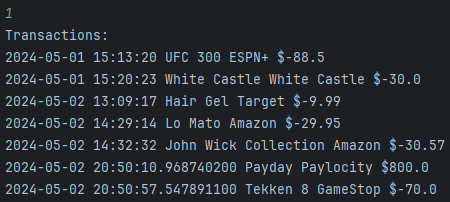

# CapstoneOne_AccountingLedger

## Table of Contents

- [Features](#features)
- [Menus](#menus)
- [Interesting Code](#interesting-code)

## Features 
- Add payment and deposits
- Generate reports by:
  - All transactions
  - Payments
  - Deposits
  - Month to date
  - Previous month
  - Year to date
  - Previous Year
  - Search by vendor

### Menus

Click to Expand

### Home Screen

Add Deposit

Make Payment (Debit)

Ledger

### Ledger Screen

All Entries

Deposits

Payments

Reports

### Reports Screen

Month To Date

Previous Month

Year To Date

Previous Year

Search by Vendor

Custom Search

Amount

## Interesting Code

Made it that if the user doesn't put a "-" when asking for the amount for Payment, it will check if the sign was entered. If yes, then continue, but if not, then it adds the sing to transasction.txt